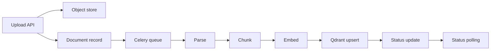
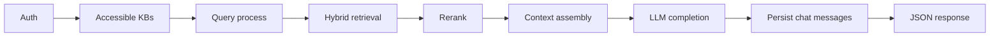

# Data Flows

## Ingestion Flow

1. **Upload:** User uploads via UI or `POST /upload/`. Backend stores the file in MinIO, creates a `Document` record in PostgreSQL, then enqueues Celery ingestion.
2. **Parse:** Worker picks up task; selects parser by MIME type; extracts text and metadata.
3. **Chunk:** Chunking pipeline splits parsed text into bounded chunks with overlap and metadata.
4. **Embed:** Chunks are embedded (local sentence-transformers when available, deterministic fallback otherwise).
5. **Index:** Vectors and payload metadata are upserted into the KB-specific Qdrant collection.
6. **Status:** Document status transitions `pending -> processing -> indexed` (or `failed` with `error_message`).
7. **UI/API:** Clients read status via `GET /documents/{document_id}/status`.

## Query Flow

1. **Auth:** Validate JWT; resolve user’s accessible KB IDs.
2. **Query:** Resolve KB from explicit `kb_id` or default accessible KB.
3. **Hybrid:** Run dense Qdrant search and sparse BM25 scoring; merge with Reciprocal Rank Fusion (RRF).
4. **Rerank:** Optionally rerank with cross-encoder when enabled.
5. **Context:** Build prompt from top source snippets and recent session history.
6. **LLM:** Generate non-streaming completion from configured provider (Ollama by default).
7. **Persist:** Save user and assistant messages to chat session storage.
8. **Client:** Return JSON payload with `answer`, `sources`, and `session_id`.
