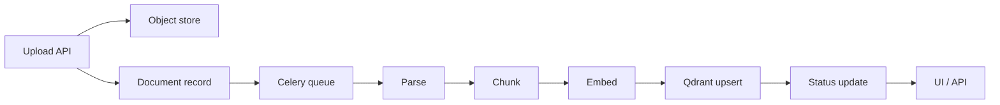
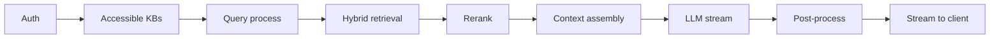

# Data Flows

## Ingestion Flow

1. **Upload:** User uploads via UI or `POST /api/upload`. Backend stores file in object store, creates a Document record in PostgreSQL, enqueues a Celery task.
2. **Parse:** Worker picks up task; selects parser by MIME type; extracts text and metadata.
3. **Chunk:** Semantic chunking pipeline produces metadata-enriched chunks.
4. **Embed:** Chunks are batched through the embedding model; dense vectors are produced.
5. **Index:** Vectors and metadata are upserted into the Qdrant collection (namespace = KB + embedding model version).
6. **Notify:** Document status set to `indexed`; status published (e.g. Redis pub/sub); UI receives update.

## Query Flow

1. **Auth:** Validate JWT; resolve user’s accessible KB IDs.
2. **Query:** Clean and optionally expand query; generate query embedding.
3. **Hybrid:** Run dense (Qdrant) and sparse (BM25) search in parallel; merge with RRF.
4. **Rerank:** Pass top-N candidates through cross-encoder; select final top-K.
5. **Context:** Build prompt with chunks, metadata, conversation history; respect context window.
6. **LLM:** Stream response from configured LLM; enforce citation format.
7. **Post-process:** Extract citations; compute RAGAS scores asynchronously; store query/answer.
8. **Client:** Stream via SSE; render source cards when response is complete.
